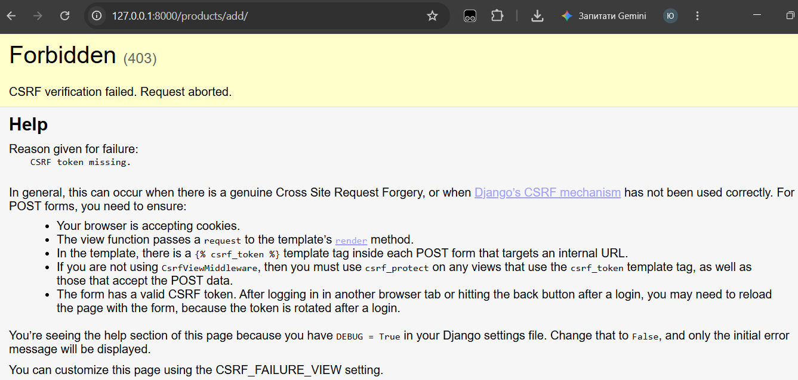

# SELF-STUDY

Звіт про самостійну роботу над ПР №2.5 «Складський застосунок на шаблонах».

## Експеримент 1: XSS та автоекранування

**Що робив:** додав товар з назвою `` через адмінку.

**Що побачив:** у браузері тег відобразився як текст, alert не з'явився. У View Source  побачив `&lt;script&gt;alert(1)&lt;/script&gt;`.

**Пояснення:** Django автоматично екранує всі змінні в шаблонах. Це захищає від XSS-атак. Фільтр `|safe` вимикає екранування, але для даних від користувача його використовувати не можна.

## Експеримент 2: DEBUG = False

**Що робив:** змінив `DEBUG = False` у settings.py, перезапустив сервер.

**Що побачив:** стилі зникли, у DevTools → Network → style.css повернув 404.

**Пояснення:** при `DEBUG = False` Django перестає роздавати статичні файли через runserver. У продакшені цим займається окремий веб-сервер (nginx). Повернув `DEBUG = True`.

## Експеримент 3: CSRF 403

**Що робив:** прибрав `` з форми, відправив її.

**Що побачив:** сторінка 403 Forbidden з текстом "CSRF verification failed. Request aborted."

**Пояснення своїми словами:** CSRF (Cross-Site Request Forgery, або міжсайтова підробка запиту) — це атака, коли зловмисний сайт змушує браузер користувача відправити запит на інший сайт від його імені. Це спосіб вкрасти дані або виконати дії без відома користувача. Django захищається від цього через CSRF-токен, і саме тому мій запит без токена було відхилено з помилкою 403.

## Джерела

## Джерела

- Методичні матеріали у ВНС
- Документація Django (офіційний сайт)
- DeepSeek (для консультацій щодо помилок)

## Що залишилось незрозумілим

Та більш-менш все було зрозуміло